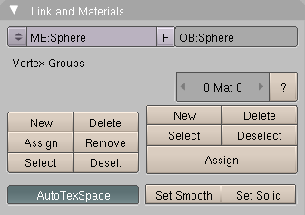
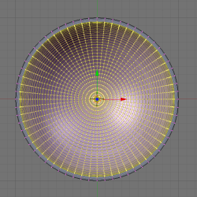
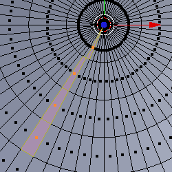
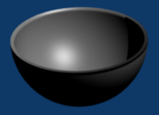
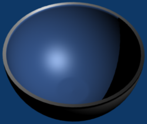
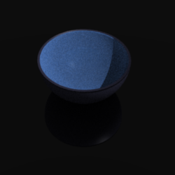

## 4.碗（Two-toned Bowl） ##

这个教程会介绍如何创建一个碗，使用到的特性如下：

- 点选择 
- 3D Cursor pivots 
- 拉伸技术 
- Vertex Groups 
- 多个材质（同一个对象）

### 创建碗模型 ###

1. 按下Del，然后Enter来删除3D立方体
2. 按下NUM7来切换到顶部视图
3. 按下SPACE
4. Add>Mesh>UVsphere
5. 改变32为64，然后点击OK
6. 再次改变32为64，然后点击OK
7. 按下NUM1到一个侧视图
8. 按下a来取消选定球体
9. 多次按下NUM+来放大球体
10. 按下b顶点选择工具
11. 选择上半部的球体
12. 按下Del，然后Enter来删除一半的顶点
13. 按下a来选择所有的顶点
14. 改变Pivot为3D Cursor

	

15. 按下e，然后Enter来拉伸半个球体
16. 再次按下Enter，不要移动鼠标，在半球起始位置的地方停止拉伸
17. 点击New来创建一个新的Vertex Group

	

18. 给这个Vertex Group命名（例如Bowl.Inside）
19. 按下s来缩放内部的碗
20. 在移动鼠标来缩放时按住CTRL
21. 按下Enter，当它看起来如下：
	
	

22. 点击Limit Selection to Visible： 
23. 按下CTRL-Tab，然后3切换到面选择模式
24. 按下SHIFT，然后在一个面上点击RMB。从中心重复三次。

	

25. 按下SHIFT-G，然后4选择相似的perimiters
26. 多次按下NUM8来显示外面的底部
27. 重复选择
28. 按下s，然后x，之后是0来缩放所有选择的顶点
29. 按下s，然后y，之后是0来缩放所有选择的顶点
30. 点击Rem Doubles
31. 点击OK来确认
32. 按下Tab到对象模式
33. 点击Set Smooth
34. 按下F12来渲染

	

35. 按下ESC来返回Blender

### 碗的颜色 ###

1. 按下NUM1，然后NUM8来看到碗的内部和外部
2. 按下F9到编辑按钮
3. 按下Tab到编辑模式
4. 点击Vertex Group下的Select来选择碗内部的顶点
5. 按下F5到材质按钮
6. 从Link to Object的选择表中选择Material
7. 改变材质的颜色为：R 0.333, G 0.533, B 0.867.
8. Select>Inverse
9. 按下F9
10. 在Link and Materials面板的Material中点击New
11. 按下F5
12. 从Link to Object选择表中选择ADD NEW
13. 按下F9
14. 在Link and Materials面板的Material.001中点击Assign
15. 按下F12来渲染，完成后按ESC

	

16. 按下F5
17. 重命名Material.001为Bowl.Outside
18. 重命名Material为Bowl.Inside
19. 改变Bowl.Outside的颜色为：R 0.188, G 0.188, B 0.267

### 反射平面和布景 ###

1. 按下NUM7
2. 按下SPACE
3. Add>Mesh>Plane
4. 按下n，然后Tab来显示Transform Properties面板
5. 改变ScaleX为10
6. 改变ScaleY为10
7. 按下NUM1
8. 在碗上点击RMB
9. 按下g，然后z，之后.981来移动碗到平面之上
10. 按下NUM0来观察摄像头的视角
11. 在平面上按下RMB
12. 反复的按F5直到Links and Properties面板出现
13. 点击Add New
14. 改变颜色（Col）为：R 0.000, G 0.000, B 0.000
15. 改变高光色（Spe）为：R 0.000, G 0.000, B 0.000
16. 点击Mirror Transp标签
17. 点击Ray Mirror
18. 改变RayMir为0.60
19. 改变Fresnel为1.00
20. 改变Depth为5
21. 点击World按钮
22. 点击Blend
23. 点击Ambient Occlusion
24. 按下F10
25. 点击50%
26. 按下F12，完成观察后按ESC

	
 