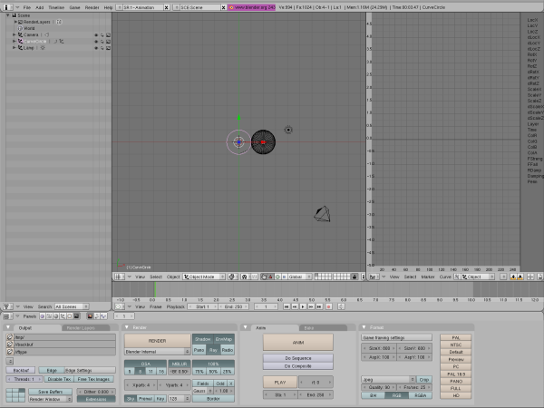
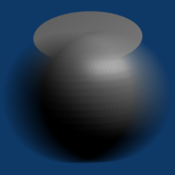

## 6.模糊对象-运动模糊（Blurry Objects - Motion Blur）  ##

### 设置 ###

重复矢量模糊的设置

### 运动中的对象 ###

1. 按下z来显示线框
2. 点击RMB来选择UVsphere
3. 按g，然后z，之后是2，Enter来移动UVsphere远离Bezier Curve
4. 点击SHIFT-RMB来重新选择Bezier Curve
5. 按下CTRL-p
6. 点击Follow Path来使Bezier Circle成为UVsphere的父路径
7. 点击SR:2-Model，然后改变为1-Animation
	
	

8. 按下F10到Scene按钮
9. 点击MBLUR

	

10. 单击RMB只选择Bezier Circle
11. 按下F9
12. 改变PathLen:从100到10

	路径是一个Bezier Circle。这控制分配到选择路径帧的数量。对于一个循环路径，一个更高的数字表示这个对象环绕它只要更少的步数。一个低一些数表示对象需要更多的步数。为了剧烈的模糊，选择一个低一些的数字。为了微妙的模糊，选择更大的数字。

### 渲染 ###

按下F12来渲染

这个UVsphere通过一个序列来绘制，然后一次渲染一帧，然后渲染16次。
次数是同通过过采样（OSA）等级来定义的。一个更高的过采样（11或16）表示渲染更多的图片，这样的质量刚好。然而，它需要更多的时间。
  
