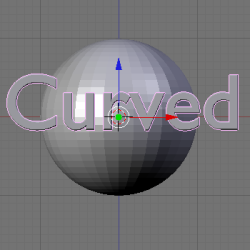
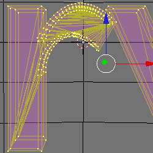
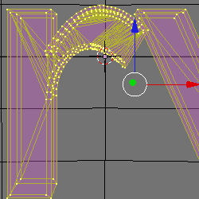
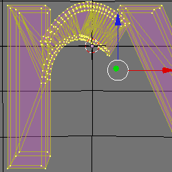
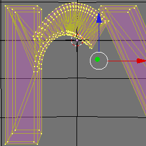
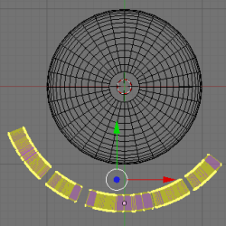

## 8.弯曲文字（Warped Text） ##

这个教程展示了如何：

- 美化文字 
- 弯曲文字

### 设置 ###

1. 按下CTRL-x，然后Enter来删除当前场景
2. 按下Del，然后Enter来删除立方体

### 球体和文字 ###

1. 按下SPACE
2. Add>Mesh>UVsphere
3. 按下OK，然后再次OK
4. 按下Tab
5. 按下NUM1切换到前视图
6. 按下SPACE
7. Add>Text
8. 按下Backspace四次来删除当前文字
9. 输入Curved为新的文字
10. 按下Tab
11. 改变Extrude:为0.100
12. 改变Bevel Depth:为0.010
13. 按下ALT-c，然后Enter
14. 再次做一遍

	文字要转变为一个网格，只有网格可以弯曲

15. 按下F9
16. 点击Centre来移动文字
17. 按下g，然后y，之后-1.5，最后Enter来移动文字远离球体，朝向摄像机

	

### 美化文字 ###

美化使用应用到网格上的过程，在操纵之后来使它更好的渲染。尽管这里是用在文字上，它也可以用在任何其它类型的网格上。

1. 按下z
2. 按下Tab
3. 按下a来选择所以的顶点
4. 按下ALT-f，然后Enter
5. 重复三到四次。

	 

	 
   
6. 按下ALT-j来转变三端面为四端面。
7. 按下CTRL-n，然后Enter来保证法线点在外面

### 弯曲文字 ###

1. 按下NUM7

	从不同的视角来变形效果不如想象的那么好，要通过顶视图，效果会好一些。

2. 按下CTRL-m，然后1来使文字沿着X轴
3. 按下SHIFT-W，然后120，Enter来弯曲文字绕着球体120度

	

### 渲染 ###

1. 按下NUM1
2. 按下Tab
3. 按下z
4. 点击Set Smooth
5. 按下NUM0来改变摄像机的视角
6. 点击RMB在摄像机的外边来选择它
7. 按下n来显示Transform Properties面板
8. 改变摄像机的参数：
	
	LocX: 0.000, LocY: -6.500, LocZ: 3.000

	RotX: 65.000, RotY: 0.000, RotZ: 0.000

9. 按下F9
10. 改变Lens：从35.00到55.00
11. 开启Ambient Occlusion
12. 按下F12

	 
