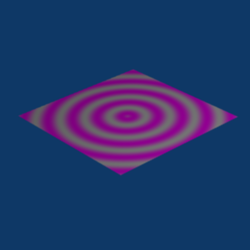
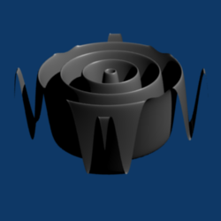
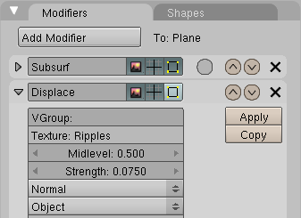
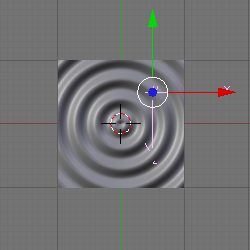
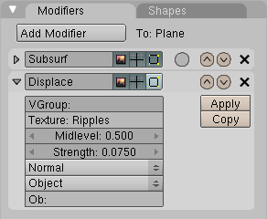
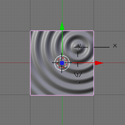
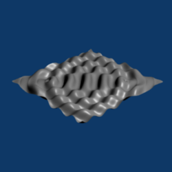

## 9.波纹（Ripples） ##

这个教程展示了如何创建波纹，和一个干涉模式，在一个平面上。用到的有：

- 一个木材纹理 
- 取代修改器 
- Empty对象 
- 改变大小面板

### 创建平面 ###

1. CTRL-x，Enter
2. Del，Enter
3. Add>Mesh>Plan
4. w
5. 点击Subdivide Multi来提示面数
6. 改变Number of Cuts：从2到100
7. 点击OK来划分平面为100个面
8. Tab

### 波纹贴图 ###

1. F5
2. 在Link to Object下，浏览现有的选择，选择Material
3. F6
4. 点击TE：Text重命名文字
5. 输入Ripples，然后按下Enter
6. 改变Texture Type为Wood
7. 点击Rings
8. 按下F12，完成后ESC

	

9. F5
10. 关闭Links and Pipeline面板
11. 在Texture选项卡点击Clear

### 位移 ###

波纹需要深度，使用一个位移修改器来完成。

1. F9
2. 点击Set Smooth
3. 点击Add Modifier>Subsurf
4. 点击Subsurf修改器折叠的小箭头
5. 点击Add Modifier>Displace
6. 点击Texture:改变用于位移的纹理
7. 输入Ripples，然后Enter
8. 按下F12，完成后ESC

	

9. 点击Strength：改变位移的大小
10. 输入0.075，然后Enter

### 位移偏移 ###

1. 点击Local>Object

	

2. NUM1
3. Add>Empty
4. g, x, .5
5. g, y, .5
6. NUM7

	

7. 点击RMB来选择波纹
8. 在按钮窗口区域中点击RMB
9. 从Panel Alignment目录中选择Horizontal

	

10. 点击Ob：
11. 输入Empty，然后Enter

	
 
### 干涉 ###

一组波纹不会自己干涉。添加更多的波纹，如下：

1. 重复“位移”部分的第五步到“位移偏移”的第四步
2. 重复“位移偏移“的四步，但要做以下改变：

	- 在第二个Empty的区域使用g x -.5，然后g y -.5 
	- 给Ob：的值输入Empty.001

3. 按下F12，完成后ESC

	 
