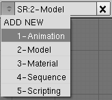
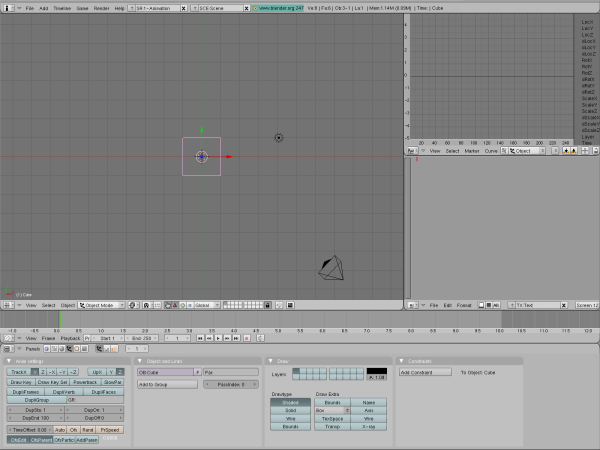
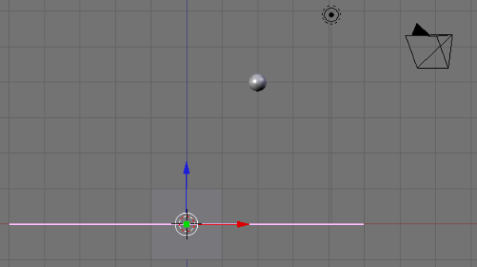
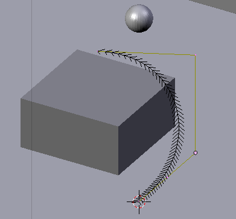

    <a href="./14.html">&laquo; 上一章</a> |
    <a href="./index.html">首页</a>

## 15.游戏引擎和路径（Game Physics and Paths） ##

这是个复杂，高级的教程展现了使用Blender的游戏引擎和路径如何创建一个动画。一个球体会下落到一个平面上，沿着一个路径移动，然后掉到一个盒子里。

Blender可以记录基于物理的动作到一个对象的IPO。这个功能允许一个记录的物理序列被渲染作为一个动画。由于路径独立于物理来控制物理对象，路径运动没有特殊的干预不会被记录。所以让我们干预一下。

### 设置环境 ###

1. 按下CTRL-x创建新文件
2. 按下OK来确认
3. 点击SR:2-Model，然后改变它为SR:1-Animation：

    

4. 分离3D view窗口的右边为两个新的窗口
5. 设置上面窗口为IPO Curve编辑器
6. 设置下面的窗口为Text编辑器
7. 移除Outliner窗口来增加3D view的空间，结果如下：

    

### 对象 ###

1. Add>Mesh>UVSphere
2. 点击OK来接受默认的选项
3. 按下s，.25，然后Enter来缩小球体
4. 按下g，x，2，然后Enter向右移动球体
5. 按下g，y，2，然后Enter向后移动球体
6. 按下g，z，4，然后Enter来向上移动球体
7. Add>Mesh>Plane
8. 按下s，5，然后Enter来改变屏幕比例
9. 按下NUM-1切换到侧视图

    

10. Add>Curve>Path
11. 按下g，y，2，然后Enter来往后移动Path
12. 按下g，z，.25，然后Enter来向上移动Path
13. Transform>Mirror>X Local
14. 按下NUM-7切换到顶视图
15. 按下Tab来编辑Path
16. 按下a取消选择所有的点
17. 点击RMB来选择最后的点（最左边）
18. 按下SHIFT-S，然后点击Selection->Cursor
19. 按下g，z，1.5，然后Enter来向上移动最后的点
20. 点击RMB来选择倒数第二的点
21. 按下g，x，1，然后Enter对齐倒数第二个点和最后一个点
22. 按下g，z，2，然后Enter向上移动倒数第二个点
23. 按下SHIFT-S，然后点击Cursor->Selection

旋转场景，可以看到类似下面的视图：

 

### 材质 ###

1. 按下Tab来停止编辑Path
2. 按下F5开启材质按钮
3. 在Cube上点击SHIFT-RMB
4. 重命名Material为Cube
5. 在Plane上点击SHIFT-RMB
6. 点击Add New
7. 重命名Material为Plane

### 记录路径IPO ###

1. 按下NUM-7切换到顶视图
2. Add>Empty
3. 按下NUM-7切换到顶视图
4. 在Path上点击SHIFT-RMB
5. 按下CTRL-p开启parenting目录
6. 点击Follow Path使Empty为Path父对象
7. 复制粘贴下面的代码到Text窗口

        # This script is used to map the IPO curve of an object as it travels
        # through frames of an animation. The algorithm follows:
        #
        # 1. Calculate number of steps needed to animate at given framerate.
        # 2. Get the selected object.
        # 3. Duplicate the selected object (which will hold the generated IPO).
        # 4. Reset the duplicate object.
        # 5. Loop over the number of frames at the calculated framerate.
        # 6. Set the active frame.
        # 7. Position the duplicate object to the same place as the selected one.
        # 8. Copy the selected object's location and rotation into the duplicate's IPO.
        #
        # Usage:
        # (1) Select the object that follows a curve.
        # (2) Load this script in Blender's Text window.
        # (3) Move the mouse to the Text window.
        # (4) Press Alt-p.
        #
      
        import Blender
        from Blender import Object, Scene

        framesPerSecond = Scene.GetCurrent().getRenderingContext().fps
        firstFrame      = 0
        lastFrame       = 100
        stepsPerFrame   = (lastFrame - firstFrame) / framesPerSecond

        selected = Object.GetSelected()[0]

        Object.Duplicate()
        duplicate = Object.GetSelected()[0]
        duplicate.clrParent()
        duplicate.clearIpo()

        for frame in range( firstFrame, lastFrame, stepsPerFrame ):
          Blender.Set( 'curframe', frame )
          duplicate.setMatrix( selected.getMatrix() )
          duplicate.insertIpoKey( Object.LOC )
          duplicate.insertIpoKey( Object.ROT )

8. 改变脚本名字为copy-path.py
9. 保存脚本为copy-path.py
10. 点击RMB来选择Empty
11. 将鼠标移动到Text窗口
12. 按下Alt-p执行脚本
13. 将鼠标移动到3D窗口
14. 按下DEL，然后Enter删除Empty.001
15. 点击RMB选择Empty
16. 按下Alt-p
17. 点击Clear Parent来移除Path为Empty的父对象
18. 重置IPO为frame 0
19. 在IPO窗口，设置Empty使用新创建的IPO数据块

    

20. 点击RMB来选择Path
21. 按下m，2，然后Enter将Path移动到另一层
22. 按下F7为对象按钮
23. 点击RMB来选择Empty
24. 设置TimeOffset为180

### Game Engine Actors ###

1. 按下F4到Logic按钮
2. 点击RMB选择球体
3. 点击Actor
4. 点击Dynamic
5. 点击Bounds
6. 设置Radius为0.75
7. 改变Box为Sphere（作为bounds类型）
8. 点击RMB来选择Plane
9. 点击Actor
10. 点击Bounds

### Game Engine Logic ###

当球体碰撞到碰面，下面的情况会发生：

- 球体将Empty作为父对象 
- Empty播放它的IPO 
- 球体的IPO的关键帧被记录作为每一帧

### 逻辑块-Empty ###

1. 点击RMB来选择Empty
2. 点击Add Property
3. 设置名字为collision
4. 改变类型为Bool
5. 点击Add，在Sensors下面
6. 设置sensor名字为s.copy
7. 点击Add，在Sensors下面
8. 改变sensor类型从Always到Property
9. 设置sensor的名字为s.ipo
10. 设置Prop的值为：collision
11. 设置Value的值为：True
12. 点击Add，在Controllers下面
13. 设置controller名字为c.copy
14. 点击Add，在Controllers下面
15. 设置controller名字为c.ipo
16. 点击Add，在Actuators下面
17. 设置actuator名字为a.copy
18. 改变actuator类型从Motion到Property
19. 改变类型从Assign到Copy
20. 设置Prop值为collision
21. 设置OB值为Sphere
22. 设置Prop值为collision
23. 点击Add，在Actuators下面
24. 改变类型从Motion到Ipo
25. 设置actuator名字为a.ipo
26. 设置End的值为100
27. 连接Sensor copy到Controller copu再到Actuator copy
28. 连接Sensor ipo到Controller ipo再到Actuator ipo

逻辑看起来如下：

 
逻辑块表示Blender不断复制球体的collision属性到Empty的属性，并且以同样的名字。一旦collision属性设定为True，Empty被指示不断的重复它的IPO。仍然设定球体的父对象为Empty，恰当的时候移除父子关系，记录球体完整的IPO曲线。

### 逻辑块-球体-Sensors ###

1. 点击Add Property
2. 设置名字为collision
3. 改变类型为Bool
4. 点击Add Property
5. 设定名字为time
6. 改变类型为Timer
7. 点击Add，在Sensors下面
8. 改变名字为s.plane
9. 改变sensor类型为Collision
10. 打开M/P
11. 设定M/P的值为Plane
12. 点击Add，在Sensors下面
13. 设定名字为s.time
14. 改变sensor类型为Property
15. 打开Active TRUE level triggering
16. 改变类型为Interval
17. 设定Prop值为time
18. 设定Min值为4.0
19. 设定Max值为4.1
20. 点击Add，在Sensors下面
21. 设定名字为s.start
22. 关闭Active TRUE level triggering
23. 点击Add，在Sensors下面
24. 设定名字为s.record
25. 设定f值为2
26. 打开Active TRUE level triggering
27. 点击Add，在Sensors下面
28. 设定名字为s.stop
29. 改变sensor类型为Collision
30. 打开M/P
31. 设定M/P值为Cube

### 逻辑块-球体-Controllers ###

1. 点击Add，在Sensors下面，五次
2. 设定sensors名字，从上到下为：

    c.plane

    c.time
    
    c.start
    
    c.record

    c.stop

3. 改变c.start和c.record的controller类型为Python
4. 创建新的text在Text窗口
5. 复制粘贴下面的代码到Text窗口：

        # This script is used to record the IPO curve of an object as it is
        # assaulted by the Game Physics engine. It should be executed automatically
        # via Logic Blocks. The algorithm follows:
        #
        # 1. Get the object being controlled by physics.
        # 2. Create a new IPO for recording the motion of that object.
        # 3. Store the IPO curves for use by the frame recorder.
        #

        import Blender

        # Get the name of the object being controlled by physics.
        #
        gameObject = GameLogic.getCurrentController().getOwner()
        objectName = gameObject.getName()[2:]

        # Create an IPO of type Object named 'Recorded IPO'.
        #
        blenderObject = Blender.Object.Get( objectName )
        ipo = Blender.Ipo.New( 'Object', 'Recorded IPO' )
        blenderObject.setIpo( ipo )

        # Get the position of gameObject as IPO curves.
        #
        locx = ipo.addCurve( 'LocX' )
        locy = ipo.addCurve( 'LocY' )
        locz = ipo.addCurve( 'LocZ' )

        # Keep a reference to the curves in a global variable. The variable
        # (GameLogic.rec) is used by a script that records the position of the
        # game Object per frame.
        #
        GameLogic.rec = [gameObject, locx, locy, locz]

6. 改变脚本名字为record-ipo.py
7. 保存脚本为record-ipo.py
8. 创建一个text在Text窗口
9. 复制粘贴下面的代码到Text窗口：

        #
        # This script is used to record the position of an object as it travels
        # through each frame, independent of the Game Physics. If Blender is set
        # to record Game Physics to IPO, toggle that menu item OFF. This is a
        # replacement. The algorithm follows:
        #
        # 1. Get the object being controlled by physics.
        # 2. Get the object's position (for a given frame).
        # 3. Update the recorded curves (stored in the global variable GameLogic.rec).
        #
        import Blender
        from Blender import Scene

        gameObject = GameLogic.getCurrentController().getOwner()
        
        position = gameObject.getPosition()
        frame = gameObject.time * Scene.GetCurrent().getRenderingContext().fps

        # Only try to update the curves if the variable has been initialised.
        #
        if hasattr( GameLogic, 'rec' ):
            # Set the curves for the X, Y, and Z axis.
            #
            GameLogic.rec[1].addBezier( (frame, position[0]) )
            GameLogic.rec[1].update()
            GameLogic.rec[2].addBezier( (frame, position[1]) )
            GameLogic.rec[2].update()
            GameLogic.rec[3].addBezier( (frame, position[2]) )
            GameLogic.rec[3].update()

10. 设置Script值：c.start为record-ipo.py
11. 设置Script值：c.record为record-frame.py
12. 点击Add，在Actuators下面，五次
13. 改变actuators类型，从上到下为：

    Property

    Parent
    
    Property
    
    Parent

    Game

14. 设置actuators的名字，从上到下为：

    a.start.parent
    
    a.parent.empty
    
    a.stop.parent

    a.parent.none

    a.stop

15. 从上到下：

    设置Prop值为: to collision.
  
    设置Value值为: to True.

    设置OB值为: to Empty.

    设置Prop值为: to collision.

    设置Value值为: to False.

    改变Set Parent为Remove Parent.

    改变Start new game为Quit this game.

16. 连接Sensors到Controllers再到Actuators

    

### 渲染动画 ###

1. 移动鼠标到3D窗口
2. 按下p来调用物理引擎
3. 按下ALT-a使用IPO曲线来播放动画
4. Render>Render Animation
