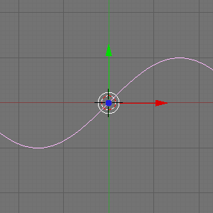

    <a href="./1.html">&laquo; 上一章</a> |
    <a href="./index.html">首页</a>
    | <a href="./3.html">下一章 &raquo;</a>

## 2.Python脚本 （Python Scripting）##

这个教程会展现如何写Python脚本。在执行这个脚本时，一个新的网格对象会添加到当前的场景中。这个网格是一个正弦波曲线。

### 设置 ###

1. 打开Blender
2. 按下DEL删除3D立方体

### 文本编辑器 ###

1. 按下SHIFT-F11，出现文本编辑器窗口。
2. 输入下面的程序：

		import math
		import Blender
		from Blender import NMesh

		x = -1 * math.pi

		mesh = NMesh.GetRaw()
		vNew = NMesh.Vert( x, math.sin( x ), 0 )
		mesh.verts.append( vNew )

		while x < math.pi:
			x += 0.1
			vOld = vNew
			vNew = NMesh.Vert( x, math.sin( x ), 0 )
			mesh.verts.append( vNew )
			mesh.addEdge( vOld, vNew )

		NMesh.PutRaw( mesh, "SineWave", 1 )
		Blender.Redraw()

### 执行脚本 ###

1. 按下鼠标右键
2. 点击Execute Script
3. 按下SHIFT-F5返回到3D View

	

### 分析一下脚本程序： ###
- 
		import math
		import blender
		from Blender import NMesh

- 表示会使用到math和blender程序包。这些程序包提供了Python Math库和Blender Python库的功能。最后一行表示使用了简明的NMesh而不是复杂的Blender.NMesh。
		

		x = -1 * math.pi

- 尽管Blender使用三维坐标，一个正弦波只用两个坐标来表示。这一行设置正弦波起始位置的下限值。这个例子中，正弦波会从-pi到+pi。

		mesh = NMesh.GetRaw()

- 创建一个新的网格对象。这个对象开始没有顶点；其它的代码用来计算这些顶点的位置，然后将它们关联到这个网格。

		vNew = NMesh.Vert( x, math.sin( x ), 0 )

- 在进入循环之前，创建了第一个顶点。由于顶点必须连接来形成边，这个脚本跟踪两个顶点：（1）刚增加的顶点；以及（2）下一个要增加的顶点。

		mesh.verts.append( vNew )

- 得到第一个顶点，然后使它成为网格的一部分。

		while x < math.pi:

- 这个循环为了开始向网格对象插入顶点。循环会一直执行知道x的值超过pi。

		x += 0.1

- 下一个顶点要比当前顶点差一个单元。最后，x值控制顶点数量成为网格的一部分。一个更小的值表示更多的顶点被添加进来，因为它需要花更多时间使x来超过pi值。

		vOld = vNew

- 跟踪顶点之前已经包含进网格。最后旧点和新点会用来创建一个边。

		vNew = NMesh.Vert( x, math.sin( x ), 0 )

- 基于x的值创建一个新的顶点。y的值是sin(x)的计算结果。一个正弦波一般不会飞出Z轴方向，所以Z值一直为0.

		mesh.verts.append( vNew )

- 关联新创建的点到网格的最后。

		mesh.addEdge( vOld, vNew )

- 在旧点和新点之间创建一条线。下一次循环发生时，新点会变成旧点。

		NMesh.PutRaw( mesh, "SineWave", 1 )

- 这条线将新创建的网格对象插入到当前场景。

		Blender.Redraw()

- 使Blender渲染当前场景。没有这行代码，网格不会出现。